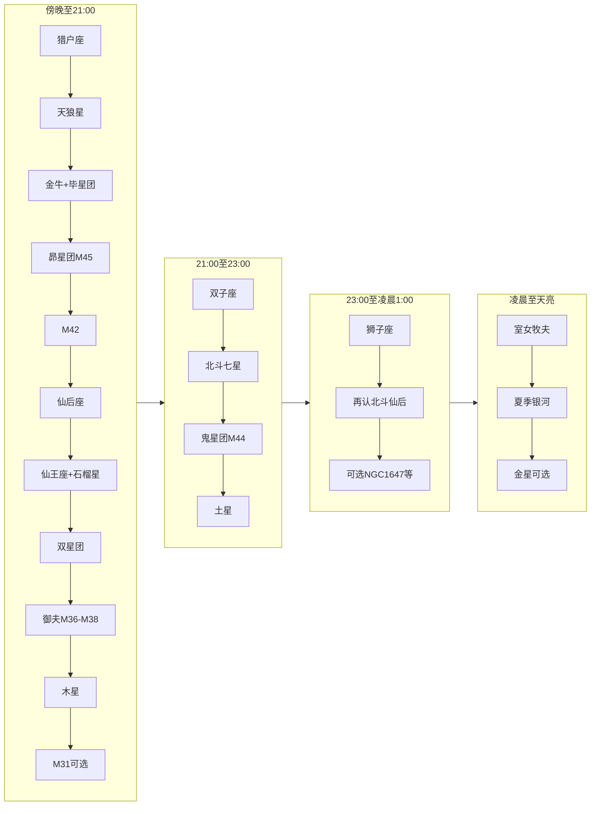

# 观星计划：临朐春节一晚

**地点**：山东潍坊临朐农村（约北纬 36.5°）  
**日期**：腊月廿八～除夕（约 2026 年 2 月 15–16 日；春节初一为 2 月 17 日）  
**器材**：裸眼 + 7×50 双筒为主力；20×80 大双筒为辅（少量使用）；普通单反拍摄数张。

---

## 观测条件与时间

- **建议开始**：日落后约 1 小时（约 18:30–19:00），待天光褪去、星空稳定。
- **建议结束**：可观测至凌晨 1 点前后；若体力与保暖允许，可延长至天亮前（见第四阶段）。
- **优先选择**：无月或弱月夜（农历廿八–除夕月相较暗，适合深空）；选无云、透明度好的日期。

---

## 行前准备（观星前一两天 / 当天）

**天气与时间**

- 出门前查天气：云量、透明度（可用「晴天钟」、Windy、或气象 App）；**无云或少量云、透明度好**再出门。
- 临朐 2 月中旬「日落后约 1 小时」约 **18:30–19:00**，可据此规划出发时间。

**行前清单（可打印勾选）**

- **器材**：7×50 双筒、20×80（可选）、单反 + 三脚架、备用电池、防露布/袋。
- **个人**：保暖（分层衣物、手套、帽子）、热饮、地垫或轻便椅子、红光手电或手机红夜模式。
- **软件**：提前装好 Stellarium 或 Star Walk，设好观测日期与地点（临朐），调成红夜模式。

---

## 完整目标清单

| 目标 | 类型 | 推荐器材 | 可见性 | 推荐度 | 备注 |
|------|------|----------|--------|--------|------|
| 猎户座 | 星座 | 裸眼 / 7×50 | 极易 | 强烈推荐 | 腰带三星为全晚路标；参宿四/参宿七颜色对比 |
| M42 猎户座大星云 | 星云 | 7×50 / 20×80 | 易 | 强烈推荐 | 猎户「佩剑」处，双筒可见云气 |
| 昴星团 M45 | 疏散星团 | 裸眼 / 7×50 | 易 | 强烈推荐 | 金牛座内，裸眼可见一小团 |
| 毕星团 Hyades | 疏散星团 | 7×50 | 易 | 强烈推荐 | 金牛座 V 字形，双筒最佳 |
| 天狼星 | 亮星 | 裸眼 | 极易 | 强烈推荐 | 夜空中最亮星，冬季大三角之一 |
| 英仙座双星团 NGC 869/884 | 疏散星团 | 裸眼 / 7×50 | 易 | 强烈推荐 | 仙后与英仙之间，7×50 极佳 |
| 鬼星团 M44 | 疏散星团 | 7×50 | 中等 | 强烈推荐 | 巨蟹座中央，蜂巢星团/积尸气；以 M44 为核心可认巨蟹座 |
| 巨蟹座 | 星座 | 7×50 | 较难 | 可选 | 无亮星；以 M44 为锚，M44 两侧两星（γ、δ Cnc）夹蜂巢，可勾出星座轮廓 |
| 御夫座 M36、M37、M38 | 疏散星团 | 7×50 | 易 | 强烈推荐 | 从五车二星跳可一次看三团 |
| 北斗七星 | 星座/星组 | 裸眼 | 易 | 推荐 | 东北方，后半夜升高 |
| 仙后座 | 星座 | 裸眼 | 易 | 推荐 | 北天 W 形，找双星团与北极用 |
| 仙王座 | 星座 | 裸眼 / 7×50 | 易 | 推荐 | 仙后与北极之间，拱极；形如尖顶屋 |
| 造父四（石榴星） | 亮星 | 裸眼 / 7×50 | 易 | 推荐 | 仙王座 μ，红橙色超巨星，赫歇尔石榴石星 |
| 金牛座 | 星座 | 裸眼 / 7×50 | 易 | 推荐 | 毕宿五橙红色，含昴星团与毕星团 |
| 双子座 | 星座 | 裸眼 | 易 | 推荐 | 北河二、北河三醒目 |
| 狮子座 | 星座 | 裸眼 / 7×50 | 易 | 推荐 | 后半夜东方；镰刀（反问号）+ 轩辕十四 + 尾五帝座一；黄道星座，从 M44 往东即到 |
| 木星 | 行星 | 裸眼 / 7×50 | 极易 | 推荐 | 2026 年 1 月冲日，2 月中旬仍整夜可见 |
| 土星 | 行星 | 裸眼 / 7×50 | 易 | 推荐 | 日落后偏南，双鱼座 |
| 冬季大三角/六边形 | 星组 | 裸眼 | 易 | 推荐 | 认星座与方位用 |
| M31 仙女座大星系 | 星系 | 7×50 / 20×80 | 较难 | 可选 | 2 月中旬西北低空，需无遮挡、少光害 |
| NGC 1647 | 疏散星团 | 7×50 | 中等 | 可选 | 金牛座，毕星团东北，顺带扫到 |
| NGC 2244（玫瑰星团） | 疏散星团 | 7×50 | 中等 | 可选 | 麒麟座，星团可见，星云需更大口径或摄影 |
| 月伴昴星团 | 天象 | 裸眼 / 单反 | 视日期 | 可选 | 观测期间若遇月近昴星团可拍照 |
| 室女座 / 牧夫座 | 星座 | 裸眼 / 7×50 | 易 | 可选 | 凌晨后东南—南天升高，角宿一、大角星醒目 |
| 夏季银河核心区 | 银河/星野 | 裸眼 / 双筒 / 单反 | 视条件 | 可选 | 天亮前东南方，人马–天蝎一带；窗口短、高度低，可拍摄 |
| 金星 | 行星 | 裸眼 | 视日期 | 可选 | 若为启明星时段，黎明前东方低空可见 |
| 天龙座 | 星座 | 裸眼 / 7×50 | 中等 | 可选 | 拱极，当夜可见；约 20:00–22:00 北天较佳，北斗与小熊之间；星较暗，5–6 月午夜上中天更易认全 |

---

## 认星起点与方向

- **先定方向**：到场地后用手机指南针或「北斗/仙后找北极」定北，再推南；或用 Stellarium/Star Walk 对一下东南西北。
- **若一时找不到猎户**：可先找**天狼星**（当晚最亮恒星），再从天狼向猎户腰带方向反推找猎户；或先找**北斗/仙后**定北天，再按时间线找仙后 → 双星团等。认完猎户与天狼后，可连出「冬季大三角」（天狼–南河三–参宿四），便于后续找南河三与双子座。
- **指北极**：从北斗**斗口**两星**天璇→天枢**连线向斗口外**延长约 5 倍**即到**北极星**（**勾陈一**，小熊座 α）；参宿七与五车二的连线也大致指向北极星。中国星官中**帝星**是**北极二**（小熊座 β，Kochab），与勾陈一不是同一颗星；北极星/勾陈一又称北辰、紫微。北斗属**大熊座**；斗柄上的**开阳**旁有**辅**（开阳增一），肉眼可试能否分辨（视力测试）。大熊座内还有阿拉伯传统的**瞪羚三跳**（三对星），沿之可星跳到**大角星**。

**天龙座寻星（龙头菱形与北斗、小北斗、织女的关系）**

- **第一步：先认北斗和小熊（小北斗）**。北斗七星在东北方，斗口两星天璇、天枢指北极星；北极星是小熊座（小北斗）斗柄的末端，小熊的「斗碗」在北极星另一侧、与北斗的斗碗大致隔着北极星相对。
- **第二步：龙头在哪里**。天龙座是拱极星座，龙身**盘绕在北天极周围**，夹在**北斗**与**小熊**之间：从北极星往「北斗斗碗」方向与往「小熊斗碗」方向看，龙身就蜿蜒在这两片区域之间。**龙头**是天龙座最容易认的部分，由**四颗星组成一个菱形**（西方称 Lozenge），即「龙头四边形」。
- **第三步：找到菱形龙头**。龙头四星为：**天棓四**（Eltanin，γ Dra，约 2.2 等，天龙座最亮）、**天棓三**（Rastaban，β Dra，约 2.8 等）、以及 **ξ Dra**（Grumium）、**ν Dra**（Kuma），四星构成一个**不规则四边形/菱形**，**龙头朝南**（菱形较尖或开口的一侧指向南方低空）。2 月中旬约 20:00–22:00，该菱形大致位于**北极星与北斗斗口之间、略偏北斗一侧**的北天区域；若北斗在东北、小熊在北极星周围，则从**北极星朝北斗斗口方向看过去**，在不到北斗斗口、离北极星约十几度的区域，可见这四颗 2–4 等星组成的菱形。
- **与织女星的关系**：织女星（天琴座 α）是夏夜亮星。**龙头菱形的「开口」朝南**；夏夜这条向南的延长线会指向武仙座与织女星方向；2 月晚间同一方向则指向南天低空（地平方向）。因此若熟悉夏夜星空，可记「龙头朝织女」帮助记忆朝向；当晚则记「龙头朝南」即可。
- **小结**：**北斗**与**小北斗（小熊）**一左一右（或一东一西）夹着北极星；**天龙**的龙身在这两者之间盘绕，**龙头菱形**在北极星与北斗之间的北天、头朝南，最亮星为天棓四（2.2 等）。星较暗，需北天无遮挡、暗适应后更易认。

**狮子座寻星（镰刀、轩辕十四、五帝座一与周围星座）**

- **何时何地**：2 月中旬**后半夜**（约 23:00～凌晨 1:00）狮子座在**东方**升高，易认；为黄道星座，春夜重要路标。
- **第一步：先找到鬼星团 M44 或双子座**。鬼星团在巨蟹座，位于双子座（北河二、北河三）与狮子座之间；若已用双筒找到 M44，**从 M44 再往东**即为狮子座。也可从双子座向东延伸，经过 M44 所在的一片较暗区域，下一片有亮星的区域就是狮子。
- **第二步：认「镰刀」与轩辕十四**。狮子座最醒目的是**镰刀**（西方称 Sickle）：**六颗星**组成一个**反向问号「？」**或弯镰形，代表狮子的头与鬃毛。镰刀**底部最亮的一颗**即**轩辕十四**（Regulus，狮子座 α，约 1.35 等），是狮子座最亮星，代表狮心；轩辕十四靠近黄道，行星与月亮常从附近经过。镰刀开口朝西（或朝双子方向），柄端朝东偏南。
- **第三步：认狮子尾五帝座一**。在镰刀（狮子「前身」）的**东侧偏南**，有一颗约 2 等的亮星**五帝座一**（Denebola，狮子座 β），代表狮子尾巴；其周围几颗星可连成小三角形或梯形，与镰刀一起构成整只狮子轮廓。
- **与室女、牧夫的关系**：狮子再往东/东南，会先后遇到**室女座**（角宿一）和**牧夫座**（大角星）；春季大曲线「北斗斗柄 → 大角星 → 角宿一」中，狮子座大致位于这条弧线东侧、角宿一之西。当晚若看到狮子，可顺带留意其后半夜更晚升起的室女与牧夫。
- **小结**：**双子 → M44（鬼星团）→ 狮子**沿黄道向东；狮子 = **镰刀（反问号）+ 轩辕十四（镰刀底）+ 五帝座一（尾）**。

**巨蟹座寻星（以鬼星团/蜂巢星团 M44 为核心）**

- **为何难认**：巨蟹座是黄道星座，但**没有 1～2 等的亮星**，最亮星也只有约 3.5～4 等，在双子（北河二、北河三）与狮子（轩辕十四）之间显得很「空」，肉眼不易直接勾出蟹形，因此需要**以星团为锚**来认星座。
- **第一步：先定「双子–狮子」之间的区域**。先找到**双子座**（北河二、北河三）和**狮子座**（镰刀与轩辕十四）；巨蟹座就在两者**正中间**的这片天区，沿黄道向东约从北河三到轩辕十四的约一半处。
- **第二步：用双筒找鬼星团 M44（蜂巢星团）**。在双子与狮子之间、亮星较少的区域，用 7×50 双筒**慢慢扫**：看到一团**密集小星**（约 1° 多宽，肉眼在暗处可为模糊光斑）即 **M44**。M44 西方又称 **Praesepe（马槽）**、**Beehive（蜂巢）**，中国古称**积尸气**或鬼宿星团，是巨蟹座的「心脏」——它就坐在巨蟹座中央。
- **第三步：以 M44 为中心认巨蟹**。M44 几乎恰好在两颗 3～4 等星**之间**：**巨蟹座 γ**（Asellus Borealis，北驴/柳宿增三）在 M44 **北侧**，**巨蟹座 δ**（Asellus Australis，南驴/鬼宿四）在 M44 **南侧**，两星像「夹着」蜂巢。双筒里：先对准 M44，再稍向**北**移可见一颗稍亮的星（γ），向**南**移可见另一颗（δ），这三者成一条短链，**M44 在中间**。以这条「两星夹蜂巢」的线为轴，可再向四周试连巨蟹座其余星点（如 α 星 Acubens 等），勾出巨蟹的大致轮廓（倒 Y 或蟹形）。
- **小结**：**巨蟹座 = 双子与狮子之间、无亮星的那段黄道**；**先找 M44，再以 M44 两侧的 γ、δ 两星认星座**。鬼星团 = 蜂巢星团 = 积尸气 = M44，是认巨蟹的最佳路标。

---

## 冬季星座口诀与星组

**冬季星座口诀（便于记忆）**

> 寒冬三星一直线，大犬天狼最耀眼。  
> 一七五二三加三，群星竞技大椭圆。  
> 参七五二指北极，猎户捕牛带双犬。  
> 双子御夫跟着来，金牛尖脸姐妹团。  
> 南天猎户拉三角，天狼老人都顶尖。  
> 北斗狮子才东升，仙后仙女已西偏。

**冬季大三角**：参宿四（猎户）、南河三（小犬）、天狼星（大犬）三颗亮星连成的三角形；南天认星与指路的核心。

**冬季大椭圆 / 冬季六边形（「一七五二三加三」）**：六颗星连成一大椭圆，均为各自星座最亮星，肉眼几乎同等级亮感（多为 0 等星左右）：
- **天狼星** -1.4 等（大犬座 α）
- **参宿七** 0.2 等（猎户座 β）
- **毕宿五** 0.9 等（金牛座 α）
- **五车二** 0.1 等（御夫座 α）
- **北河三** 1.2 等（双子座 β）
- **南河三** 0.4 等（小犬座 α）

在五车二和天狼星之间画一条大弧线，可串起北河二（1.6 等）、北河三、南河三。**记忆双子座**：北河二靠近五车二，北河三靠近南河三；双子座为黄道星座。

---

## 一晚时间线

### 第一阶段：日落后约 1 小时～21:00（南、西、北）

1. **猎户座** — 南方高空，腰带三星作路标。若找不到：先找天狼星（最亮）或北斗/仙后定方向后再找。
2. **天狼星** — 猎户腰带向左下延长约 **20°** 即到全天最亮恒星天狼星（-1.4 等）。
3. **金牛座 + 毕星团（Hyades）** — 腰带向与天狼星**相反方向**延长约 **20°** 到橙红色毕宿五（0.9 等）；毕宿五边上除毕宿五外的 V 字形星群即毕星团。
4. **昴星团 M45** — 从腰带到毕宿五的箭头再往前约 **15°** 即到昴星团（宽约 2°，又称七姐妹）；裸眼可见，7×50 星点更多。（若遇月伴昴星团可留意并拍照。）
5. **M42 猎户座大星云** — 猎户腰带正下方「佩剑」（佩刀）**中间**，视星等约 4 等，肉眼看为光斑，双筒下很清楚。
6. **仙后座** — 转向北天，找 W 形。
7. **仙王座与造父四（石榴星）** — 仙后座与北极星之间，仙王座呈尖顶屋形，北天拱极；其内**造父四**（仙王座 μ）即**石榴星**（赫歇尔石榴石星），红橙色，变光约 3.4–5.1 等，裸眼可见颜色。
8. **英仙座双星团（NGC 869/884）** — 从仙后座 γ 向东约 7° 扫，或介于仙后与英仙之间；裸眼可见模糊斑块，7×50 最佳。
9. **御夫座 M36、M37、M38** — **五车二**：从猎户腰带中点向北，穿过参宿四与参宿五之间的猎户顶部，延长约 **45°** 即到天顶附近的五车二（御夫座 α，0.1 等，冬夜仅次于天狼星）。从五车二与金牛座 Elnath 连线可星跳 M37（中间）、M36、M38；7×50 宽场可同视场见多个。
10. **木星** — 整夜可见，当前最亮「星」之一，可随时指认。
11. **M31 仙女座大星系（可选）** — 西北方低空，无遮挡、光害小时用 7×50 或 20×80 扫仙女座方向。

### 第二阶段：约 21:00～23:00（东南、东北、天顶）

12. **双子座** — 猎户左上方，北河二（1.6 等）、北河三（1.2 等）并排。记忆：北河二靠近五车二，北河三靠近南河三；双子座为黄道星座。五车二与天狼星之间的大弧线可串起北河二、北河三、南河三。
13. **北斗七星（大熊座）** — 东北方，斗口朝下或侧向。斗口两星天璇、天枢延长约 5 倍即北极星（勾陈一，小熊座 α）；帝星为北极二（小熊座 β），在勾陈一附近。斗柄上开阳与辅为著名双星（肉眼可试分辨）；大熊座内「瞪羚三跳」三对星可星跳至大角星。
14. **鬼星团 M44 与巨蟹座** — 双子与狮子之间即**巨蟹座**（无亮星，较难认）。用双筒在中间亮星稀疏处扫，见一团密集小星即 **M44**（蜂巢星团/积尸气）；M44 位于巨蟹中央，其**北侧**有巨蟹座 γ（约 4 等）、**南侧**有 δ（约 4 等），两星「夹着」蜂巢，可据此认巨蟹。详见上文「巨蟹座寻星」。
15. **土星** — 日落后偏南，双鱼座，可在此段或更早顺带看。

### 第三阶段：约 23:00～凌晨 1:00（东方、北斗升高）

16. **狮子座** — 从鬼星团 M44 再往东即到。先认**镰刀**（六星成反问号「？」），镰刀底部最亮为**轩辕十四**（狮子座 α，约 1.35 等）；狮子尾为**五帝座一**（β，约 2 等），在镰刀东侧偏南。详见上文「狮子座寻星」。
17. **再次看北斗与仙后** — 北斗升高，便于指认北方与星跳。可顺带找**天龙座**：先认北斗与小熊（小北斗），龙头为**北极星与北斗斗口之间**北天上的**菱形四星**（天棓四最亮 2.2 等），头朝南；详见上文「天龙座寻星」。**建议观看时段约 20:00–22:00** 北天，拱极故当夜可见。
18. **可选**：天龙座（见上）；NGC 1647（金牛）、NGC 2244（麒麟座方向），用 7×50 按星图扫。

### 第四阶段：约凌晨 1:00～天亮（东南、南天，春/夏星空）

19. **室女座与牧夫座** — 狮子座继续向东/南，室女座角宿一、牧夫座大角星陆续升高，裸眼易认；可顺带用 7×50 扫室女座星系（较暗，视条件）。
20. **夏季银河核心区（人马–天蝎一带）** — 天亮前约 4:00–5:30，银河最亮的一段从东南方低空升起。需东南方开阔、无遮挡；裸眼可见一条淡亮带，7×50 可扫人马座、天蝎座附近星云星团（如 M8、M20 等，高度较低）。**单反拍摄**：广角朝东南，三脚架固定，单张 10–20 秒或多张叠加；窗口约 1–1.5 小时，之后晨光变亮。
21. **金星（若为启明星时段）** — 黎明前若金星在东方升起，可在东方低空看到，裸眼即可；可用星图 App 查当日是否可见。
22. **收尾** — 晨光出现前收拾器材，注意保暖与安全。

---

## 观测顺序简图（便于记忆）

**若时间有限（约 1 小时内）**：完成第一阶段中 1–8 与 10 即可（猎户 → 天狼 → 金牛+毕星团 → 昴星团 → M42 → 仙后 → 仙王座+石榴星 → 双星团 → 木星），舍去后半夜的鬼星团、狮子等。**带小孩/家庭**：优先裸眼与 7×50，减少长时间使用 20×80；中间休息与保暖，避免久站。

---

## 器材使用要点

- **裸眼**：先适应黑暗 15–20 分钟；认冬季大三角、猎户、北斗、仙后等路标后再用双筒。
- **7×50**：主力，常见视场约 7°（寻星时「向东约 7°」即约一个视场）。先裸眼定好目标大致区域，再举双筒；手稳或靠墙/支架，M42、鬼星团、M31 更易看清。
- **20×80**：倍率高、视场小，适合已用 7×50 找到的目标做细节观察（如 M42 云气、双星团、M31）；需支架或靠墙，使用时间可短一些。
- **双筒与单反**：看星与拍照可交替；拍照时尽量用红夜模式/低亮度，减少对暗适应的影响。
- **星图/App**：观星前一晚用 Stellarium/Star Walk 把日期时间设为观测夜、地点设为临朐，在手机里过一遍猎户/仙后/双星团位置，现场认星更顺利。

---

## 单反简要拍摄建议

- **广角星野/星座**：猎户+天狼、冬季大三角、北斗等；三脚架固定，短曝光（如 5–15 秒）、低 ISO（如 800–1600），避免拖线；可多张后期拼接。
- **M42**：无赤道仪时可短曝多张（如 3–5 秒）后期叠加，或单张短曝记录；有赤道仪可适当延长曝光。
- **星轨**：朝北拍同心圆弧；多张叠加或单张长曝；注意保暖与电池电量。
- **月伴昴星团**（若观测当晚月亮靠近昴星团）：单张即可，注意不要过曝月球。
- **夏季银河**（天亮前东南方）：广角朝东南，三脚架固定，单张 10–20 秒或多张叠加；需东南方开阔，窗口约 4:00–5:30，晨光前结束。

---

## 安全与舒适

- **保暖**：冬季农村夜间很冷，多穿 layers、戴手套；可带热饮。
- **选址**：尽量远离路灯、门窗光；选开阔、无遮挡、地面安全的场地。
- **照明**：用红光手电或手机红夜模式，减少对暗适应破坏。
- **星图/App**：Stellarium、Star Walk 等，调至红夜模式、尽量压低亮度，仅需时看一眼定位。

---

## 常见问题与观测小贴士

- **某目标看不到（如 M42、鬼星团、M31）**：可能是光害稍大、有云、或尚未暗适应。可先看别的，过一会儿再试，或留到下次；M31、NGC 1647、NGC 2244、月伴昴星团为「有则看、没有可跳过」。
- **视宁度与透明度**：视宁度差时星点易闪烁（尤其低空）；透明度差时深空目标（星云、星系）更难见。选无云、通透的夜出门效果最好。
- **双筒里「向东约 7°」**：7×50 常见视场约 7°，即约等于「向仙后 W 东侧移动一个视场」的距离；可先用 App 模拟再现场找。
- **天龙座**：当夜可见。寻星要点：先找北斗与小熊（小北斗），**龙头**即**北极星与北斗斗口之间**的**菱形四星**（天棓四、天棓三等），头朝南；与织女的关系见上文「天龙座寻星」。2 月中旬建议 **约 20:00–22:00** 北天；星较暗，需暗夜；若想认全龙形可改在 **5–6 月午夜上中天**时观测。
- **巨蟹座**：星座无亮星，建议**以鬼星团 M44 为核心**认星座：先找双子与狮子，用双筒在中间扫到 M44；M44 北侧有 γ、南侧有 δ 两星夹着蜂巢，据此可勾出巨蟹轮廓。详见上文「巨蟹座寻星」。

---

## 常用星名中英对照（便于查阅）

| 中文名 | 英文/编号 | 星座或说明 |
|--------|-----------|------------|
| 参宿四 | Betelgeuse | 猎户座 α |
| 参宿七 | Rigel | 猎户座 β |
| 天狼星 | Sirius | 大犬座 α |
| 南河三 | Procyon | 小犬座 α |
| 毕宿五 | Aldebaran | 金牛座 α |
| 五车二 | Capella | 御夫座 α |
| 北河二 / 北河三 | Castor / Pollux | 双子座 α、β |
| 轩辕十四 | Regulus | 狮子座 α，镰刀底部，约 1.35 等；黄道带亮星 |
| 五帝座一 | Denebola | 狮子座 β，狮子尾，约 2.1 等 |
| 角宿一 | Spica | 室女座 α |
| 大角星 | Arcturus | 牧夫座 α |
| Elnath | Elnath (β Tau) | 金牛座 β，近御夫座 |
| 天枢 / 天璇 | Dubhe / Merak | 大熊座 α、β，北斗斗口指极星 |
| 开阳 / 辅 | Mizar / Alcor | 大熊座 ζ 及开阳增一，北斗斗柄双星 |
| 北极星 / 勾陈一 | Polaris (α UMi) | 小熊座 α，近北天极；又称北辰、紫微 |
| 帝星 / 北极二 | Kochab (β UMi) | 小熊座 β，星官「北极」之「帝」；非当前北极星 |
| 造父四 / 石榴星 | Mu Cephei (μ Cep) | 仙王座 μ，红橙色超巨星；赫歇尔石榴石星 |
| 天棓四 | Eltanin (γ Dra) | 天龙座 γ，天龙座最亮星，约 2.2 等；龙头菱形之一 |
| 天棓三 | Rastaban (β Dra) | 天龙座 β，约 2.8 等；龙头菱形之一 |
| 柳宿增三 / 鬼宿四（北驴/南驴） | Asellus Borealis / Australis (γ, δ Cnc) | 巨蟹座 γ、δ，M44 蜂巢星团北侧与南侧的两星，约 4 等；夹着鬼星团 |

---

**记录与后续**：可简单记一下今晚看了哪几个、哪个印象最深；下次可再试 M31、NGC 2244 或不同季节的观星计划。

**极为推荐目标的详细介绍与寻星、观感、天文背景见 [重点推荐观星目标](重点推荐观星目标)。**
