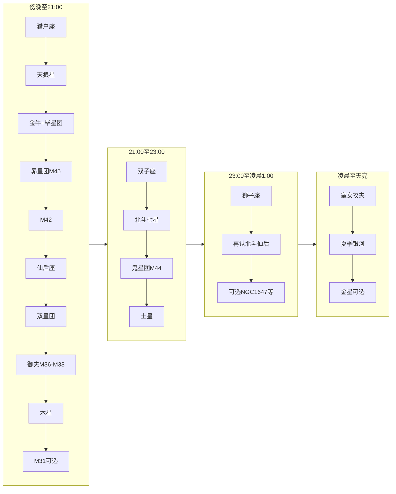

# 观星计划：临朐春节一晚

**地点**：山东潍坊临朐农村（约北纬 36.5°）  
**日期**：腊月廿八～除夕（约 2026 年 2 月 15–16 日；春节初一为 2 月 17 日）  
**器材**：裸眼 + 7×50 双筒为主力；20×80 大双筒为辅（少量使用）；普通单反拍摄数张。

---

## 观测条件与时间

- **建议开始**：日落后约 1 小时（约 18:30–19:00），待天光褪去、星空稳定。
- **建议结束**：可观测至凌晨 1 点前后；若体力与保暖允许，可延长至天亮前（见第四阶段）。
- **优先选择**：无月或弱月夜（农历廿八–除夕月相较暗，适合深空）；选无云、透明度好的日期。

---

## 行前准备（观星前一两天 / 当天）

**天气与时间**

- 出门前查天气：云量、透明度（可用「晴天钟」、Windy、或气象 App）；**无云或少量云、透明度好**再出门。
- 临朐 2 月中旬「日落后约 1 小时」约 **18:30–19:00**，可据此规划出发时间。

**行前清单（可打印勾选）**

- **器材**：7×50 双筒、20×80（可选）、单反 + 三脚架、备用电池、防露布/袋。
- **个人**：保暖（分层衣物、手套、帽子）、热饮、地垫或轻便椅子、红光手电或手机红夜模式。
- **软件**：提前装好 Stellarium 或 Star Walk，设好观测日期与地点（临朐），调成红夜模式。

---

## 完整目标清单

| 目标 | 类型 | 推荐器材 | 可见性 | 推荐度 | 备注 |
|------|------|----------|--------|--------|------|
| 猎户座 | 星座 | 裸眼 / 7×50 | 极易 | 强烈推荐 | 腰带三星为全晚路标；参宿四/参宿七颜色对比 |
| M42 猎户座大星云 | 星云 | 7×50 / 20×80 | 易 | 强烈推荐 | 猎户「佩剑」处，双筒可见云气 |
| 昴星团 M45 | 疏散星团 | 裸眼 / 7×50 | 易 | 强烈推荐 | 金牛座内，裸眼可见一小团 |
| 毕星团 Hyades | 疏散星团 | 7×50 | 易 | 强烈推荐 | 金牛座 V 字形，双筒最佳 |
| 天狼星 | 亮星 | 裸眼 | 极易 | 强烈推荐 | 夜空中最亮星，冬季大三角之一 |
| 英仙座双星团 NGC 869/884 | 疏散星团 | 裸眼 / 7×50 | 易 | 强烈推荐 | 仙后与英仙之间，7×50 极佳 |
| 鬼星团 M44 | 疏散星团 | 7×50 | 中等 | 强烈推荐 | 巨蟹座，双子与狮子之间 |
| 御夫座 M36、M37、M38 | 疏散星团 | 7×50 | 易 | 强烈推荐 | 从五车二星跳可一次看三团 |
| 北斗七星 | 星座/星组 | 裸眼 | 易 | 推荐 | 东北方，后半夜升高 |
| 仙后座 | 星座 | 裸眼 | 易 | 推荐 | 北天 W 形，找双星团与北极用 |
| 金牛座 | 星座 | 裸眼 / 7×50 | 易 | 推荐 | 毕宿五橙红色，含昴星团与毕星团 |
| 双子座 | 星座 | 裸眼 | 易 | 推荐 | 北河二、北河三醒目 |
| 狮子座 | 星座 | 裸眼 | 易 | 推荐 | 后半夜东方，「镰刀」+ 轩辕十四 |
| 木星 | 行星 | 裸眼 / 7×50 | 极易 | 推荐 | 2026 年 1 月冲日，2 月中旬仍整夜可见 |
| 土星 | 行星 | 裸眼 / 7×50 | 易 | 推荐 | 日落后偏南，双鱼座 |
| 冬季大三角/六边形 | 星组 | 裸眼 | 易 | 推荐 | 认星座与方位用 |
| M31 仙女座大星系 | 星系 | 7×50 / 20×80 | 较难 | 可选 | 2 月中旬西北低空，需无遮挡、少光害 |
| NGC 1647 | 疏散星团 | 7×50 | 中等 | 可选 | 金牛座，毕星团东北，顺带扫到 |
| NGC 2244（玫瑰星团） | 疏散星团 | 7×50 | 中等 | 可选 | 麒麟座，星团可见，星云需更大口径或摄影 |
| 月伴昴星团 | 天象 | 裸眼 / 单反 | 视日期 | 可选 | 观测期间若遇月近昴星团可拍照 |
| 室女座 / 牧夫座 | 星座 | 裸眼 / 7×50 | 易 | 可选 | 凌晨后东南—南天升高，角宿一、大角星醒目 |
| 夏季银河核心区 | 银河/星野 | 裸眼 / 双筒 / 单反 | 视条件 | 可选 | 天亮前东南方，人马–天蝎一带；窗口短、高度低，可拍摄 |
| 金星 | 行星 | 裸眼 | 视日期 | 可选 | 若为启明星时段，黎明前东方低空可见 |

---

## 认星起点与方向

- **先定方向**：到场地后用手机指南针或「北斗/仙后找北极」定北，再推南；或用 Stellarium/Star Walk 对一下东南西北。
- **若一时找不到猎户**：可先找**天狼星**（当晚最亮恒星），再从天狼向猎户腰带方向反推找猎户；或先找**北斗/仙后**定北天，再按时间线找仙后 → 双星团等。认完猎户与天狼后，可连出「冬季大三角」（天狼–南河三–参宿四），便于后续找南河三与双子座。

---

## 一晚时间线

### 第一阶段：日落后约 1 小时～21:00（南、西、北）

1. **猎户座** — 南方高空，腰带三星作路标。若找不到：先找天狼星（最亮）或北斗/仙后定方向后再找。
2. **天狼星** — 猎户腰带向左下延伸，最亮星。
3. **金牛座 + 毕星团（Hyades）** — 猎户腰带向右上：橙红色毕宿五与 V 字形毕星团；7×50 看全 V 形。
4. **昴星团 M45** — 毕宿五/毕星团西北方向一小团亮星；裸眼可见，7×50 星点更多。（若遇月伴昴星团可留意并拍照。）
5. **M42 猎户座大星云** — 猎户腰带正下方「佩剑」处。
6. **仙后座** — 转向北天，找 W 形。
7. **英仙座双星团（NGC 869/884）** — 从仙后座 γ 向东约 7° 扫，或介于仙后与英仙之间；裸眼可见模糊斑块，7×50 最佳。
8. **御夫座 M36、M37、M38** — 从五车二（御夫座 α）与金牛座 Elnath 连线，M37 约在中间，M36、M38 在其附近；7×50 宽场可同视场见多个。
9. **木星** — 整夜可见，当前最亮「星」之一，可随时指认。
10. **M31 仙女座大星系（可选）** — 西北方低空，无遮挡、光害小时用 7×50 或 20×80 扫仙女座方向。

### 第二阶段：约 21:00～23:00（东南、东北、天顶）

11. **双子座** — 猎户左上方，北河二、北河三并排。
12. **北斗七星** — 东北方，斗口朝下或侧向。
13. **鬼星团 M44** — 双子与狮子之间（巨蟹座），用双筒在亮星较稀疏处扫，见密集小星团即 M44。
14. **土星** — 日落后偏南，双鱼座，可在此段或更早顺带看。

### 第三阶段：约 23:00～凌晨 1:00（东方、北斗升高）

15. **狮子座** — 从鬼星团再往东，「镰刀」与轩辕十四易认。
16. **再次看北斗与仙后** — 北斗升高，便于指认北方与星跳。
17. **可选**：NGC 1647（金牛）、NGC 2244（麒麟座方向），用 7×50 按星图扫。

### 第四阶段：约凌晨 1:00～天亮（东南、南天，春/夏星空）

18. **室女座与牧夫座** — 狮子座继续向东/南，室女座角宿一、牧夫座大角星陆续升高，裸眼易认；可顺带用 7×50 扫室女座星系（较暗，视条件）。
19. **夏季银河核心区（人马–天蝎一带）** — 天亮前约 4:00–5:30，银河最亮的一段从东南方低空升起。需东南方开阔、无遮挡；裸眼可见一条淡亮带，7×50 可扫人马座、天蝎座附近星云星团（如 M8、M20 等，高度较低）。**单反拍摄**：广角朝东南，三脚架固定，单张 10–20 秒或多张叠加；窗口约 1–1.5 小时，之后晨光变亮。
20. **金星（若为启明星时段）** — 黎明前若金星在东方升起，可在东方低空看到，裸眼即可；可用星图 App 查当日是否可见。
21. **收尾** — 晨光出现前收拾器材，注意保暖与安全。

---

## 观测顺序简图（便于记忆）

**若时间有限（约 1 小时内）**：完成第一阶段中 1–7 与 9 即可（猎户 → 天狼 → 金牛+毕星团 → 昴星团 → M42 → 仙后+双星团 → 木星），舍去后半夜的鬼星团、狮子等。**带小孩/家庭**：优先裸眼与 7×50，减少长时间使用 20×80；中间休息与保暖，避免久站。

---

## 器材使用要点

- **裸眼**：先适应黑暗 15–20 分钟；认冬季大三角、猎户、北斗、仙后等路标后再用双筒。
- **7×50**：主力，常见视场约 7°（寻星时「向东约 7°」即约一个视场）。先裸眼定好目标大致区域，再举双筒；手稳或靠墙/支架，M42、鬼星团、M31 更易看清。
- **20×80**：倍率高、视场小，适合已用 7×50 找到的目标做细节观察（如 M42 云气、双星团、M31）；需支架或靠墙，使用时间可短一些。
- **双筒与单反**：看星与拍照可交替；拍照时尽量用红夜模式/低亮度，减少对暗适应的影响。
- **星图/App**：观星前一晚用 Stellarium/Star Walk 把日期时间设为观测夜、地点设为临朐，在手机里过一遍猎户/仙后/双星团位置，现场认星更顺利。

---

## 单反简要拍摄建议

- **广角星野/星座**：猎户+天狼、冬季大三角、北斗等；三脚架固定，短曝光（如 5–15 秒）、低 ISO（如 800–1600），避免拖线；可多张后期拼接。
- **M42**：无赤道仪时可短曝多张（如 3–5 秒）后期叠加，或单张短曝记录；有赤道仪可适当延长曝光。
- **星轨**：朝北拍同心圆弧；多张叠加或单张长曝；注意保暖与电池电量。
- **月伴昴星团**（若观测当晚月亮靠近昴星团）：单张即可，注意不要过曝月球。
- **夏季银河**（天亮前东南方）：广角朝东南，三脚架固定，单张 10–20 秒或多张叠加；需东南方开阔，窗口约 4:00–5:30，晨光前结束。

---

## 安全与舒适

- **保暖**：冬季农村夜间很冷，多穿 layers、戴手套；可带热饮。
- **选址**：尽量远离路灯、门窗光；选开阔、无遮挡、地面安全的场地。
- **照明**：用红光手电或手机红夜模式，减少对暗适应破坏。
- **星图/App**：Stellarium、Star Walk 等，调至红夜模式、尽量压低亮度，仅需时看一眼定位。

---

## 常见问题与观测小贴士

- **某目标看不到（如 M42、鬼星团、M31）**：可能是光害稍大、有云、或尚未暗适应。可先看别的，过一会儿再试，或留到下次；M31、NGC 1647、NGC 2244、月伴昴星团为「有则看、没有可跳过」。
- **视宁度与透明度**：视宁度差时星点易闪烁（尤其低空）；透明度差时深空目标（星云、星系）更难见。选无云、通透的夜出门效果最好。
- **双筒里「向东约 7°」**：7×50 常见视场约 7°，即约等于「向仙后 W 东侧移动一个视场」的距离；可先用 App 模拟再现场找。

---

## 常用星名中英对照（便于查阅）

| 中文名 | 英文/编号 | 星座或说明 |
|--------|-----------|------------|
| 参宿四 | Betelgeuse | 猎户座 α |
| 参宿七 | Rigel | 猎户座 β |
| 天狼星 | Sirius | 大犬座 α |
| 南河三 | Procyon | 小犬座 α |
| 毕宿五 | Aldebaran | 金牛座 α |
| 五车二 | Capella | 御夫座 α |
| 北河二 / 北河三 | Castor / Pollux | 双子座 α、β |
| 轩辕十四 | Regulus | 狮子座 α |
| 角宿一 | Spica | 室女座 α |
| 大角星 | Arcturus | 牧夫座 α |
| Elnath | Elnath (β Tau) | 金牛座 β，近御夫座 |

---

**记录与后续**：可简单记一下今晚看了哪几个、哪个印象最深；下次可再试 M31、NGC 2244 或不同季节的观星计划。

**极为推荐目标的详细介绍与寻星、观感、天文背景见 [重点推荐观星目标.md](重点推荐观星目标.md)。**
